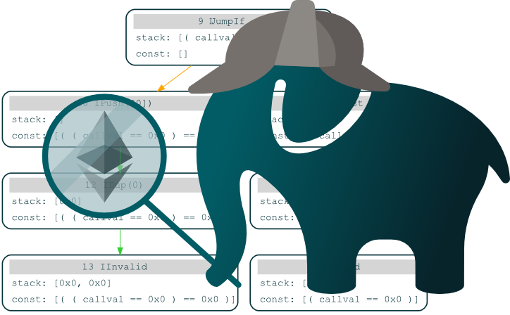

# EthBMC: A Bounded Model Checker for Smart Contracts

<p>
 
</p>

This is the code repository for our Usenix Security 2020 paper [EthBMC](https://www.ei.ruhr-uni-bochum.de/media/emma/veroeffentlichungen/2020/04/02/EthBMC-USENIX20.pdf).


> The introduction of smart contracts has significantly advanced the state-of-the-art in cryptocurrencies. Smart contracts are programs who live on the blockchain, governing the flow of money. However, the promise of monetary gain has attracted miscreants, resulting in spectacular hacks which resulted in the loss of millions worth of currency. In response, several powerful static analysis tools were developed to address these problems. We surveyed eight recently proposed static analyzers for Ethereum smart contracts and found that none of them captures all relevant features of the Ethereum ecosystem. For example, we discovered that a precise memory model is missing and inter-contract analysis is only partially supported.
>
> Based on these insights, we present the design and implementation of, a bounded model checker based on symbolic execution which provides a precise model of the Ethereum network. We demonstrate its capabilities in a series of experiments. First, we compare against the eight aforementioned tools, showing that even relatively simple toy examples can obstruct other analyzers. Further proving that precise modeling is indispensable, we leverage ETHBmc capabilities for automatic vulnerability scanning. We perform a large-scale analysis of roughly 2.2 million accounts currently active on the blockchain and automatically generate 5,905 valid inputs which trigger a vulnerability. From these, 1,989 can destroy a contract at will (so called suicidal contracts) and the rest can be used by an adversary to arbitrarily extract money. Finally, we compare our large-scale analysis against two previous analysis runs, finding significantly more inputs (22.8%) than previous approaches.

## Requirements

To compile and use EthBMC you will need:

- Rust nightly (tested with version 1.44.0)
- [go-ethereum](https://github.com/ethereum/go-ethereum) stand alone evm; make sure it is in your PATH (tested with version 1.8.27)
- We offer support for three different smt solvers (tested with yices2 version 2.6.1. Note we recommend Yices2; see Section 6.5 in the paper):
	- [Z3](https://github.com/Z3Prover/z3)
	- [Yices2](https://github.com/SRI-CSL/yices2)
	- [Boolector](https://github.com/Boolector/boolector)


When using the webservice-version (see esvm/bin):
- Configuration is done using a [Rocket.toml](https://rocket.rs/v0.4/guide/configuration/#rockettoml)
- When using the Service with timeouts the service expects a ethbmc binary in the PATH

### Binaries

- ethbmc: Simple stand alone binary
- ethbmc-service: Webservice which accepts accounts and returns the result as json
- ethbmc-scheduler: Accepts two lists, an account list and a server list, then distributes the accounts between the backing servers running a service instance


### Building

```
cargo build --release
```
Note when analyzing big contracts you might have to increase Rusts stack size, see [here](https://stackoverflow.com/questions/29937697/how-to-set-the-thread-stack-size-during-compile-time).

### Usage
```
EthBMC 1.0.0
EthBMC: A Bounded Model Checker for Smart Contracts

USAGE:
    ethbmc [FLAGS] [OPTIONS] <INPUT>

FLAGS:
    -x, --acc                 The input is an Ethereum account address, must be used with parity backend, mainnet only
        --concrete-copy       Use concrete calldatacopy
    -d, --debug-grap          Dump debug graph after analysis
        --no-optimizations    Disable all optimizations
        --dump-solver         Dump all solver queries to ./queries
    -h, --help                Prints help information
        --json                Output json without logging
        --list                The input is a list of Ethereum account address, writes the result to a csv file in the
                              output folder
        --no-verify           Skip verification phase.
    -V, --version             Prints version information

OPTIONS:
        --block <block>                      The blocknumber to evaluate, defaults to latest block. Note you will need
                                             an archive node for anaylzing blocks which are not the latest.
    -c, --call-bound <call_bound>            Set bound for calls
        --cores <cores>                      Set the amount of cores the se can use
        --ip <ip>                            The ip of a running node.
    -b, --loop-bound <loop_bound>            Set bound for loops
    -m, --message-bound <message_bound>      Set bound for message iteration
        --port <port>                        The port of a running node.
        --solver <solver>                    The SMT solver to use: z3, boolector, yices2 [yices2]
        --solver-timeout <solver-timeout>    Set solver timeout in milliseconds

ARGS:
    <INPUT>    Set input file / address
```

The easiest way to use EthBMC is to create an input yml file (see examples):
```
./target/release/ethbmc examples/rubixi/rubixi.yml
```

When you have a running Ethereum node you can also use it to analyze an on-chain account:
```
./target/release/ethbmc -x --ip ip.to.your.node  0xAccount_Address
```

When you have an archive node you can also use it to analyze an account at a specific block:
```
./target/release/ethbmc -x --ip ip.to.your.node --block block_number_to_analyze 0xAccount_Address
```

Note when executing the parity example (examples/parity) we recommend limiting the loop execution to 1 and use concrete-copy. The bug can still be found without these restrictions, but it takes a long time.

```
./target/release/ethbmc -b1 --concrete-copy examples/parity/parity.yml
```

### Patched Parity Node

For the on-chain analysis (Section 6.2) we used a patched parity node to obtain the storage of an account (the code can be found [here](https://github.com/Joool/openethereum)). You can still use a normal node which supports the web3 API. However, the analysis then does not take storage variables into account (all variables are assumed to be zero). Note to analyze blocks at an earlier time you will need to use a patched archive node.

## Tests

- Test can only be run one at a time at the moment (cargo test -- --test-threads=1)
- Integration tests take a long time and should allways be run with optimizations (cargo test integra --release -- --ignored)
- Some tests need a deployed parity instance, set PARITY_IP env var to the corresponding ip (PARITY_IP=127.0.0.1 cargo test parity -- --test-threads=1 --ignored)

You can run all test with the supplied shell script (requires archive patched parity node):
```
	PARITY_IP=127.0.0.1 ./run_all_test.sh
```

## BibTeX

When you cite our work please use the following bibtex entry:
```
@inproceedings {frank2020ethbmc,
	title={ETHBMC: A Bounded Model Checker for Smart Contracts},
  	author={Frank, Joel and Aschermann, Cornelius and Holz, Thorsten},
	booktitle = {USENIX Security Symposium (USENIX Security)},
	year = {2020},
}
```

## Acknowledgement
We would like to thank the [parity](https://www.parity.io/) team for open-sourcing their code.
